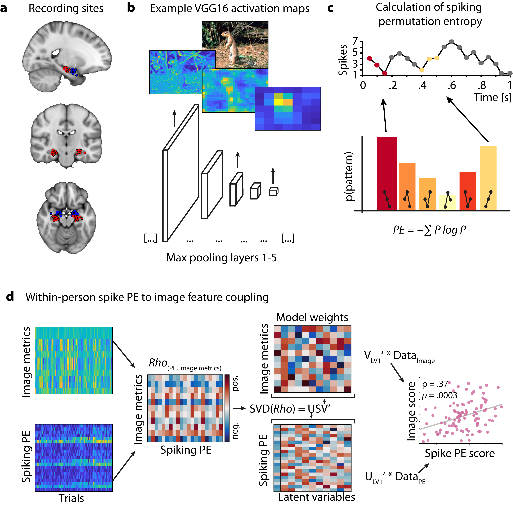

# SpikeVar
In this repository you can find code that reproduces all main results of the *spikevar* project.

*Fig. 1: Estimating latentent coupling between image features and hippocampal spike entropy*

# Description
The *SpikeVar* project investigates the neural representation of stimuli "content" in the hippocampus during memory encoding. Using computational modelling and human single-cell recordings, we show that individuals who are able to up/downregulate the hippocampal spiking variability in correspondence to trial-wise stimuli features, also remember the presented stimuli better. 

The project consists of four main parts. First, we estimate the feature content of the presented stimuli using a neural network approach employing HMAX [1] and VGG16 [2] (Fig. 1b). Second, the spiking variability of the single cell recordings are computed. We employ permutation entropy [3] as measure of spiking variability (Fig. 1c). Third, we use partial least squares analysis (PLS) [4] to find the latent coupling between trial-wise hippocampal spiking variability and feature content across early/late/all layers in the neural network (Fig. 1d, left). Finally, we model the behavioral recognition data using a GLM approach to estimate relation between the regulation of hippocampal spiking variability and memory performance during recall (Fig. 1d, right). 

All reported p-values were estimated using non-parametrical permutation tests. 

# Code structure
As mentioned above, there are four main parts to the *spikevar* project. The corresponding code to each of these parts can be found in the following subfolders 

    1. stimuli 
    2. neuro 
    3. pls
    4. behav
    5. perm

The script **main.m** runs the complete analysis pipeline and reproduces the main results from the paper. 
Permutation tests are computed separately by scripts in folder perm, as this takes more time.

# System requirements
- The analysis was done using *Matlab2020a* and *python3*.

# Toolboxes
- Stimuli feature contents were computed using *[HMAX](https://github.com/joshrule/hmax)* and the *[VGG16](https://www.tensorflow.org/api_docs/python/tf/keras/applications/vgg16/VGG16)* implementation in tensorflow (v2.4.1). 
- To estimate the spike permutation entropy we used the *[EntropyHub](https://www.entropyhub.xyz/index.html)* package. 
- To estimate the PLS we used [PLSrank](https://github.com/LNDG/PLS_rank)
- For plotting we used [RainCloudPlots](https://github.com/RainCloudPlots/RainCloudPlots) and cbrewer

# References
[1] *M. Riesenhuber, T. Poggio, Hierarchical models of object recognition in cortex. Nat Neurosci. 2, 1019–1025 (1999).*

[2] *K. Simonyan, A. Zisserman, Very Deep Convolutional        Networks for Large-Scale Image Recognition. Arxiv (2014).*

[3] *C. Bandt, B. Pompe, Permutation Entropy: A Natural Complexity Measure for Time Series. Phys Rev Lett. 88, 174102 (2002).*

[4] *A. R. McIntosh, F. L. Bookstein, J. V. Haxby, C. L. Grady, Spatial Pattern Analysis of Functional Brain Images Using Partial Least Squares. Neuroimage. 3, 143–157 (1996).*
 

